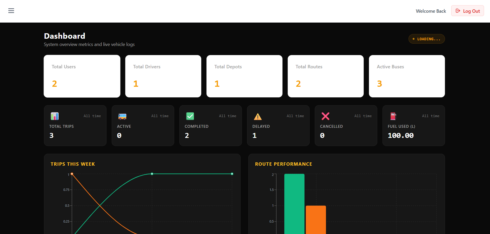
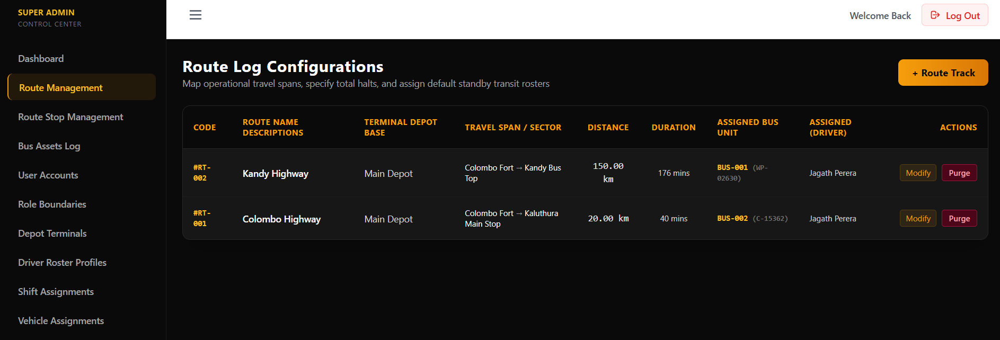
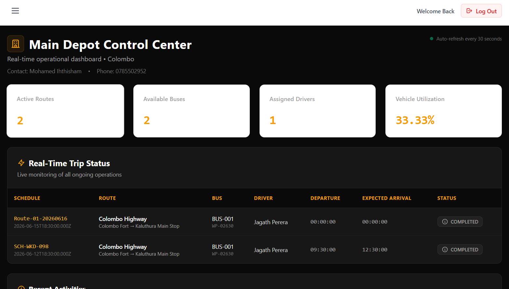
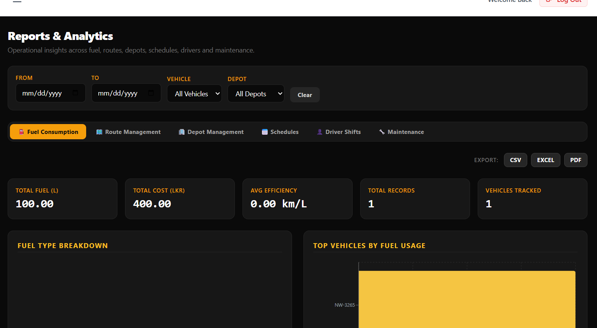
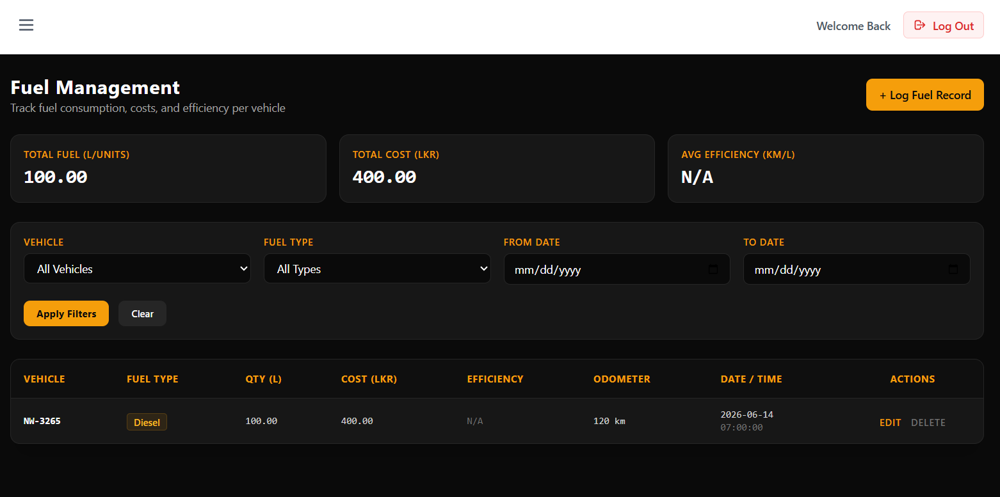

# 🚌 SRMSS - Smart Route Management & Scheduling System

SRMSS (Smart Route Management & Scheduling System) is a web-based system developed to manage bus routes, schedules, depots, vehicles, drivers, and trips efficiently. The system provides a centralized dashboard for administrators to monitor transport operations and manage daily scheduling.

---

# Features

## Super Admin

- Dashboard with live statistics
- Route Management
- Route Stop Management
- Depot Management
- Vehicle Management
- Driver Management
- User Account Management
- Role & Permission Management
- Shift Assignment
- Vehicle Assignment
- Schedule Management
- Recurring Schedule Creation
- Trip Management
- Fuel Log Management

---

# Technology Stack

## Frontend

- React.js
- React Router
- Axios
- TailwinCSS

## Backend

- Node.js
- Express.js
- MySQL
- JWT Authentication
- bcrypt

---

# Project Structure

```
SRMSS
│
├── frontend
│   ├── src
│   ├── public
│   └── package.json
│
├── backend
│   ├── controllers
│   ├── routes
│   ├── middleware
│   ├── config
│   ├── models
│   └── package.json
│
└── README.md
```

---

# Installation

## 1. Clone Repository

```bash
git clone https://github.com/your-username/SRMSS.git

cd SRMSS
```

---

## 2. Install Frontend

```bash
cd frontend
npm install
```

---

## 3. Install Backend

```bash
cd backend
npm install
```

---

# Environment Variables

Create a `.env` file inside the **backend** folder.

Example:

```env
PORT=5000

DB_HOST=localhost
DB_USER=root
DB_PASSWORD=your_password
DB_NAME=srmss

JWT_SECRET=your_secret_key
```

---

# Running the Project

## Start Backend

```bash
cd backend
npm run dev
```

Backend runs on

```
http://localhost:5000
```

---

## Start Frontend

Open another terminal

```bash
cd frontend
npm start
```

Frontend runs on

```
http://localhost:3000
```

---

# Default Login

> Update these credentials according to your seeded database.

```
Username : superadmin
Password : admin123
```

---

# Modules

- Dashboard
- Route Management
- Route Stop Management
- Depot Management
- Vehicle Management
- Driver Management
- User Management
- Shift Assignment
- Vehicle Assignment
- Schedule Management
- Recurring Schedules
- Trip Management
- Fuel Logs

---

# API

The backend exposes REST APIs for:

- Authentication
- Users
- Routes
- Route Stops
- Depots
- Vehicles
- Drivers
- Schedules
- Trips
- Fuel Logs

---

# Screenshots

## Dashboard



## Route Management



## Depot Dashboard



## Report and Analysis



## Fuel Management



---

# Future Improvements

- GPS Tracking
- Live Bus Monitoring
- Passenger Mobile App
- Notifications
- Reports & Analytics
- Email Alerts
- SMS Alerts

---

# Contributors

- Mohamed Ihthisham
- Aaqib Nazar
- Khalid
- Rizna

---

# License

This project is developed for educational and research purposes.
